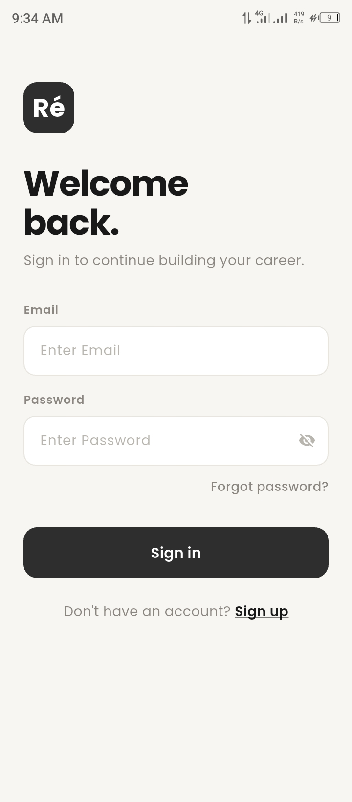
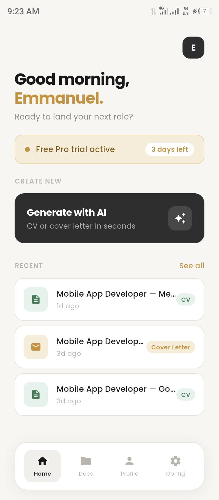
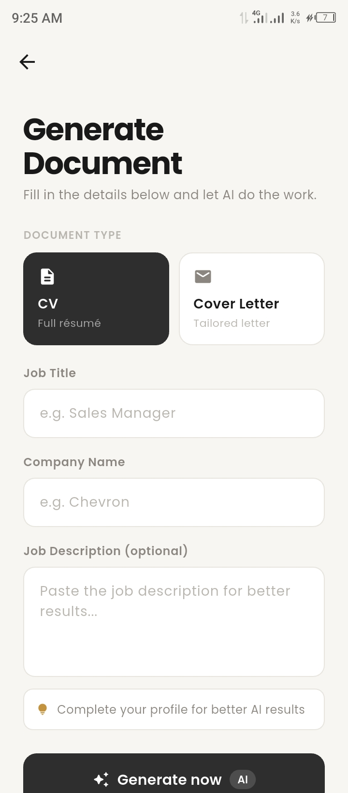
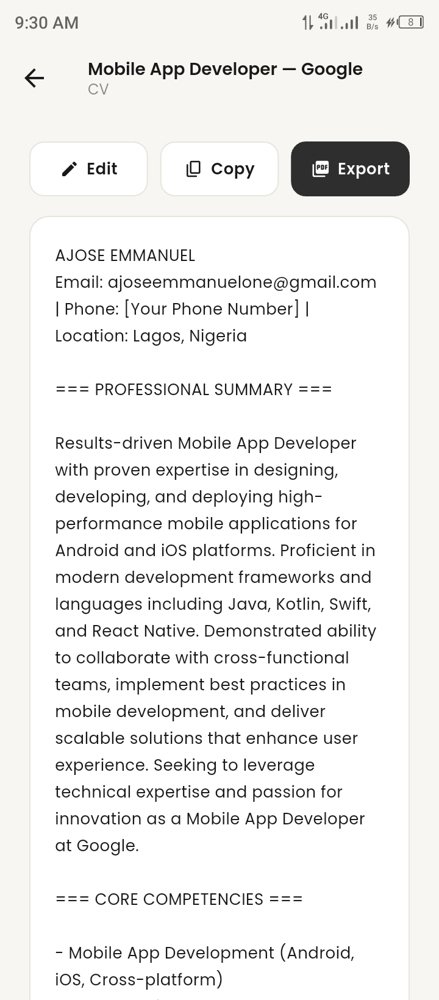
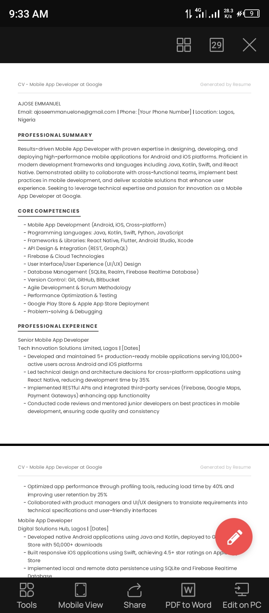
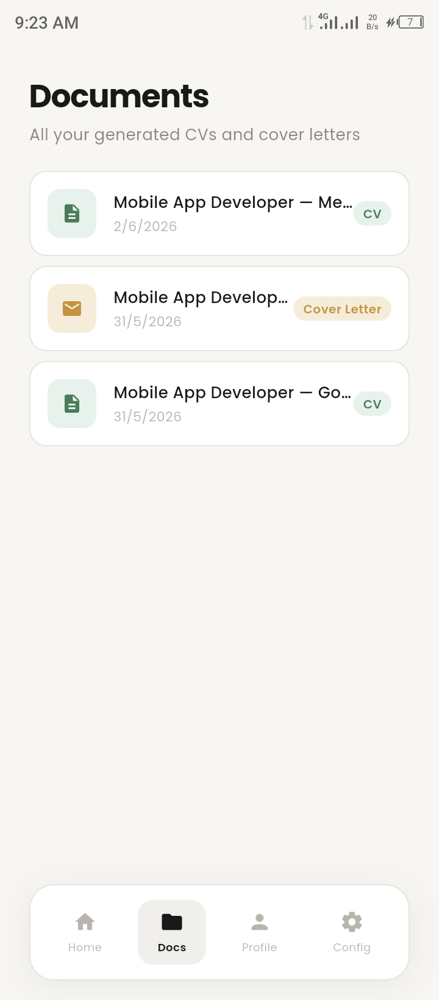
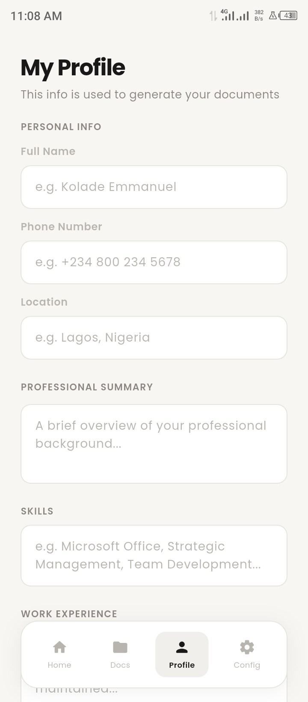
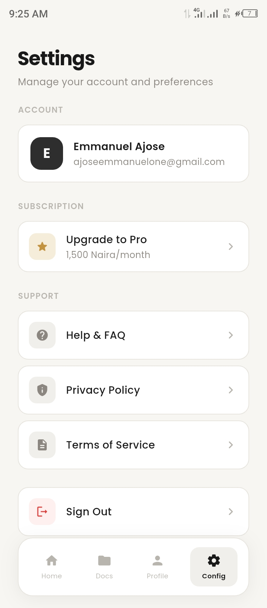

# Resume - AI CV Generator 📄
An AI-powered CV and cover letter generator, tailored for the Nigerian job market. Generate professional, ATS-friendly CVs and cover letters in seconds.

---

## 🚀 Available on Google Play
The app is currently in closed testing and will be publicly available on the Google Play Store soon. Stay tuned!

---

## Screenshots

  
  
  
  
  
  
  
  

---

## Features

### AI Generation
- **AI-Powered CV** — Generate a complete, ATS-friendly CV tailored to a specific job and company in seconds
- **AI Cover Letter** — Generate a compelling, personalised cover letter for any role
- **Nigerian Job Market** — Understands NYSC, HND/BSc distinctions, and local industry norms
- **Job Description Input** — Paste a job description for even more tailored results
- **Edit Before Export** — Edit AI-generated content directly in the app before saving or exporting

### Documents
- **Save History** — All generated CVs and cover letters saved automatically to your account
- **PDF Export** — Export any document as a clean, shareable PDF with one tap
- **Copy to Clipboard** — Copy the full text of any document instantly
- **Recent Documents** — Quickly access your most recently generated documents from the home screen

### Authentication
- **Email & Password Auth** — Register and log in securely via Firebase Auth
- **Email Verification** — Verify your email before accessing the app
- **Forgot Password** — Reset your password via email link
- **Persistent Login** — Stay logged in across app restarts

### Profile
- **User Profile** — Set up your profile once with your experience, education, skills, and NYSC status
- **Edit Profile** — Update your profile at any time for better AI results
- **Nigerian Format** — Profile fields designed for the Nigerian job market including NYSC section

### Subscription
- **7-Day Free Trial** — Full Pro access on first install, no credit card required
- **Pro Plan** — ₦1,500/month for unlimited generations, PDF export, and saved history
- **Restore Purchases** — Restore active subscription after reinstalling or switching devices
- **Access Gating** — Paywall shown automatically when trial or subscription expires

### General
- **FAQ** — In-app answers to common questions
- **Privacy Policy** — In-app privacy policy
- **Terms of Service** — In-app terms of service
- **Sign Out** — Securely sign out from the settings screen

---

## Built With
- [Flutter](https://flutter.dev/) — UI framework
- [Firebase Authentication](https://firebase.google.com/products/auth) — User login and registration
- [Cloud Firestore](https://firebase.google.com/products/firestore) — Cloud database
- [Anthropic Claude API](https://www.anthropic.com/) — AI document generation
- [RevenueCat](https://www.revenuecat.com/) — Subscription management and Google Play Billing

---

## Architecture
- **Pattern:** Feature-based folder structure
- **State Management:** setState with StatefulWidgets
- **Backend:** Firebase (Auth + Firestore)
- **AI:** Anthropic Claude API (claude-haiku-4-5)
- **Subscriptions:** RevenueCat + Google Play Billing

---

## Subscription Model
| Plan | Price | Features |
|---|---|---|
| Free Trial | 7 days free | Full Pro access |
| Pro | ₦1,500/month | Unlimited generations, PDF export, saved history |

---

## Author
**Ajose Emmanuel**
